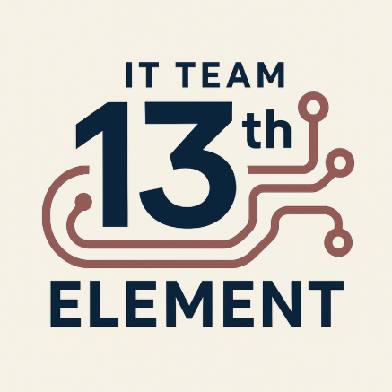

# 🪑 Mebleria

> **Timeline:** 1 week **Team:** [13th-element](#our-team)

---

## 📖 Project Overview

**Mebleria** is a sample web page created as a collaborative team project. The
goal was to combine modern design, usability, and teamwork into a single
product.

---

## 👥 Our Team

| 👨‍💻 Developer        |   🏷️ GitHub Nick    |          📂 Sections / Modals          | 🎯 Role     |
| ------------------- | :-----------------: | :------------------------------------: | :---------- |
| Oleksandr Vakulin   |    **AlekS-V1**     | Hero, Footer / Header, Furniture Modal | TeamLead    |
| Olena Borysenko     |  **Olenka-12345**   |        Header, Furniture Modal         | Developer   |
| Valeriia Tverdovska |     **deviwax**     |             Furniture List             | Developer   |
| Alina Serhienko     |   **Alinka-Kim**    |                About us                | Developer   |
| Oleksandra Nabokova |   **a-nabokova**    |                  FAQ                   | Developer   |
| Viktoriia Minets    | **victoria-minets** |                Feedback                | ScrumMaster |
| Vira Khan           |    **ViraKhan**     |              Order Modal               | Developer   |

---

## 🌟 Key Features

- 🎨 **Stylish design** — appealing to those who value aesthetics.
- 🧭 **Easy navigation** — quick access to essential information.
- 🪑 **Furniture filter** — browse categories with lazy loading for performance.
- ⚡ **Fast ordering** — modal window in just a few clicks.
- ❓ **FAQ & reviews** — help users make confident purchase decisions.

---

## 👩‍💼 Target User

**Natalia, 31, Sales Manager (Vinnytsia, Ukraine):**

- Married, studying psychology alongside her career.
- Recently finished renovating her new apartment and is searching for furniture.
- Prefers pastel colors that reduce stress and look great on Instagram.
- Values beauty and time efficiency — wants quick, stylish solutions.
- Needs delivery and assembly services in her city.

---

## 🛠️ Challenges & Solutions

- 🔀 **Branch conflicts** — solved through persistent teamwork.
- 👥 **Limited participants** — redistributed tasks based on interest and
  availability.
- 🖼️ **Image rendering issues** — fixed by adjusting file paths and rating star
  display with team support.

---

## 💻 Tech Stack

- **Frontend:** HTML, CSS, JavaScript
- **Libraries:** loaders.css, Axios, Swiper, iziToast, css-star-rating,
  Pagination
- **Build Tools:** Vite, Vanilla App

---

## 🧰 Utilities

- VSCode
- Figma
- Trello
- Git/GitHub
